## Lab2. Hardware Control
<p align=right>20123383 진수현</p>

---

### Preparations

###### 1. GPIO를 이용한 하드웨어 제어에 대해 이해한다.

- 라즈베리 파이의 GPIO 핀 구조는 아래와 같다.


- General Purpose Input Output의 약자로 `범용 입력 출력`이란 의미를 가진다. 마이크로프로세서가 주변장치와 통신하기 위해 범용으로 사용되는 입력 출력 포트로써, 하나의 연결 단자를 입력이나 출력으로 고정시키지 않고 선택적으로 사용할 수 있게 융통성을 높인 범용 입출력 단자이다.

<br>

- GPIO는 프로그래머가 그 포트에 대해 입력이냐 출력이냐를 설정할 수 있으며, GPIO 포트는 프로그래머가 설정하기 이전에 사용이 불가능하므로, 사용할 GPIO 포트에 대한 설정을 반드시 지정해야 한다. 입력과 출력이 지정되어 있는 것 보다 자유도가 높아지지만, 그만큼 선택이라는 일을 해야 한다.

<br>

- GPIO는 입력과 출력 포트를 제어하기 위해 3개의 레지스터를 갖고 있으며, 3개의 레지스터는 PORTx, DDRx, PINx으로 이루어져 있다. PORTx는 말 그대로 포트에 대한 내용이고, PINx는 포트를 이루고 있는 핀에 대한 내용이다.
<br>


###### 2. RPi.GPIO 및 WiringPi에 대한 내용을 읽고 이해한다.

- 아두이노 Wiring 시스템을 이용한 사람들에게 익숙하도록 설계된 C언어 라이브러리
- BCM2835/BCM2836의 GPIO 사용을 위한 C언어 라이브러리
- 아두이노 문법과 비슷하게 설계

> WiringPi를 사용하기 위해서는 git 패키지가 필요로 하다 그러므로 git 패키지를 최우선적으로 설치를 해야한다.

<br>

- git 패키지 설치
```bash
sudo apt-get install git-core
```


- wiringPi 소스코드 빌드 후 설치
```bash
git clone git://git.drogon.net/wiringPi
cd wiringPi/
git pull origin
./build
```
> 위 과정을 순서대로 하면 git 명령어를 이용해서 wiringPi 소스코드를 내려받은 후 빌드해서 설치를 하는 과정.

<br>

###### 3. I2C, SPI, 10wire, UART 등의 직렬통신 방식에 대한 내용을 읽고 이해한다.

| 항목 | UART | SPI | I2C |
|:--------|--------|--------|--------|
| Interface Diagram |  |  ||
| 핀 | TxD: Transmit Data<br>RxD: Receive Data | SCLK: Serial Clock<br>MOSI: Master Output, Slave Input<br>MISO: Master Input, Slave Output<br>SS: Slave Select |SDA: Serial Data<br>SCL: Serial Clock |
| Data Rate 데이터 전송 속도 | 비동기(asynchronous) 통신이기 때문에 공유하는 Clock  이 없어서 통신하는 양쪽 기기의 속도를 동일하게 맞춰 주어야 한다. 동일하지 않아도 통신이 되는 경우가 있지만 의도하지 않은 데이터가 들어갈 경우가 있다. Maximum 통신 속도는 Model 에 따라 다르며, 일반적으로 115,200bps 이다. | SPI에서 최대 데이터 속도는 정해져 있지 않다. 보통 10Mbps 에서 20Mbps 사이 이다. | I2C는 100Kbps, 400Kbps, 3.4Mbps 를 주로 사용하며 10Kbps 나 1Mbps를 사용하는 경우도 있다. |
| Type of communication 통신의 종류 | 비동기 | 동기 | 동기 |
| 장점 | 하드웨어가 간단해서 거의 모든 장치에서 UART를 지원하기 때문에 (9개의 핀이 연결되거나, USB가 있는 장치라면) 편리하다. RS232 라고도 불린다. RS232는 protocol의 이름이며 UART는 그것을 가능하게 해 주는 송수신기를 의미하기 때문이다. | 간단한 프로토콜이기 때문에 구현하는데 어렵지 않다. Full duplex(전체 동시 송수신, 전이중) 통신을 지원한다. 나뉘어진 slave select 라인이 있기 때문에 같은 종류의 칩들이 회로에 사용될 수 있다.SPI는 push-pull을 사용하기 때문에 높은 데이터 전송률을 가지며 긴 거리도 가능하다.SPI는 I2C와 비교하면 적은 파워를 사용한다. | Open collector 디자인이기 때문에 slew rate(출력 전압의 최대 변화율, 모양이 이상해 지는 것)가 제한적이다. |
| 단점 | 1:1 통신만 지원한다.동일한 속도를 맞추고 시작해야 한다. 그렇지 않으면 데이터가 깨질 것이다. Voltage level 이 동일해야 한다. | Slave가 많아지면 각 slave별 라인이 필요하기 때문에 hardware 구성이 복잡해진다. |Master와 slave가 많아지면 복잡성이 증가한다. |


<br>

###### 4. RTC, ADC, Sensor 등에 대한 내용을 읽고 이해한다.

- RTC
> Real Time Clock 모듈. 즉,  실시간으로 시간이 흐르는 것을 제어하기 위한 부품. RTC 모듈을 활용해서 특정한 시간에 어떠한 작동을 한다던가 (예를 들면, 알람이 울린다? 불빛을 낸다? 등) 일정 시간 단위로 입력되는 값을 저장하고 출력할 수 있다.

<br>

- ADC
> ADC란 Analog to Digital Converter의 준말로, 아날로그 신호(0~5V 사이의 전압)을 디지털 값으로 반환해 주는 기능을 의미합니다. 아두이노에서는 이런 ADC 기능을 analogRead()라는 함수로 제공하며, 0~1023의 정수값을 반환하는데 이는 0~5V의 전압에 선형적으로 비례하기 됩니다. 따라서 우리는 반환된 정수값을 토대로 실제 핀에 들어오는 전압 값을 역산할 수 있다.

<br>

- Sensor
> 센서란 직접 피측정 대상에 접촉하거나 그 가까이서 데이터를 알아내어 필요한 정보를 신호로 전달하는 장치를 총칭해서 센서(감지기)라고 한다. 센서는 자연에 존재하는 어떠한 물리적인 양을 측정하기 위한 장치로서 특히 전기전자에서는 측정된 값을 전기신호로 바꾸어 주는 장치들을 통틀어서 센서라고 할 수 있다.

> 센서는 능동적 센서와 수동적 센서로 나눌 수 있다. 능동적 센서는 센싱(sensing,감지)을 위하여 장치에서 특정 신호를 발생시켜 그 신호를 기반으로 센싱을 하는 센서이다.(ex. 초음파 거리 측정 센서) 수동적 센서는 센서가 어떠한 지점의 물리 양을 측정하기 위해 능동적으로 환경에 무언가를 만들어 내지 않는 센서이다.(ex.반도체 가스 센서)

> 즉, 원하는 것을 감지/측정하여 신호를 전달하는 장치를 센서(Sensor)라고 한다.

<br>

###### 5. 적외선 통신 방식에 대한 내용을 읽고 이해한다.

- 적외선이란?
IR(Infrared)라고 부르며, 가시광선보다 파장이 길며, 햇빛이나 백열된 물체로 부터 방출되는 빛을 스펙트럼으로 분산시켜 보면 적색스펙트럼의 끝보다 더 바깥쪽에 있으므로 적외선이라 한다.


<br>

> 적외선 통신은 송신부와 수신부로 나누어 지고, TV를 예로 들면 TV가 수신부, TV리모컨이 송신부가 된다. 송신부는 IRED로 적외선 발광 다이오드라고 생각하면 된다. 일반 LED와 비슷하다고 생각하면되고 차이점은 일반 LED는 전류가 흐르면 가시광선을 출력하지만, IRED는 전류가 흐르면 적외선을 출력한다는 것이다. 적외선은 사람의 눈으로는 보이지 않기 때문에 IRED가 빛을 내고있는지 눈으로 확인할 수는 없다. 하지만 일반 카메라나 휴대폰 카메라는 적외선 빛을 볼수 있다. 그렇기 때문에 카메라로 IRED를 보게 되면 빛을 내는지 확인 할 수 있다.


<br>

###### 6. 디스플레이 장치에 대해 이해한다.

- 아래 실습을 통해 수행.

---

### Practice sequence

#### Practice 1.
```
Default Hardware Device Control

1. GPIO 를 이용하여, LED, 푸시 버튼 등을 제어할 수 있는 테스트 프로그램을 작성하여 제대로 동작하는지 테스트해 본다.

2. LED의 밝기를 SW 적으로 제어하여 보고 그 원리를 정리해 본다.

3. 기타 푸시 버튼 등의 다른 장치들도 제어해 본다.

4. 푸시 버튼의 bouncing(한번에 한번 이상 눌러지는 현상)을 해결해 보고 그 원리를 정리해 본다.

5. HTML 문서 및 CGI 프로그램 형태로 제어할 수 있도록 구현하여 본다.
```

###### Practice Code

- [ledWeb.py]
```python
from bottle import route, run,template
import RPi.GPIO as GPIO

led=18
btn=24
ledStates=[0]

GPIO.setmode(GPIO.BCM)
GPIO.setup(led,GPIO.OUT)
GPIO.setup(btn,GPIO.IN,pull_up_down=GPIO.PUD_DOWN)

def update_leds():
  print 'led state : ' + str(ledStates[0])
  GPIO.output(led,ledStates[0])

control_page="""
<script>
function changed(){
window.location.href='/'
}
</script>
<h1>GPIO Control</h1>
<h2> Button
%if btnState:
=Down
%else:
=Up
% end
</h2>
<input type='button' onClick='changed()')
value='LED {{led}}'/>
"""

@route('/')
@route('/<led>')
def index():
  ledStates[0] = not ledStates[0]
  update_leds()
  state= GPIO.input(btn)
  return template(control_page, btnState=state,led=0)

run(host='0.0.0.0',port=8080)
```

- [ledPush.py]
```python
import RPi.GPIO as GPIO
import time


led=18
btn=24
GPIO.setmode(GPIO.BCM)
GPIO.setup(led,GPIO.OUT)
GPIO.setup(btn,GPIO.IN)


while(True):
  value = GPIO.input(btn)
  if value==True:
    GPIO.output(led,True)
  GPIO.output(led,False)
```

- [ledDuty.py]
```python
import RPi.GPIO as GPIO
import time


led=18
GPIO.setmode(GPIO.BCM)
GPIO.setup(led,GPIO.OUT)
GPIO.setup(24,GPIO.IN)

pwd_led = GPIO.PWM(led,50)
pwd_led.start(100)

while(True):
  duty_s = raw_input("Enter Bightness Value (0 to 100):")
  duty = int(duty_s)
  pwd_led.ChangeDutyCycle(duty)
  time.sleep(0.5)
```

- [ledBoucing.py]
```python
import RPi.GPIO as GPIO
from time import sleep
GPIO.setmode(GPIO.BCM)

GPIO.setup(19, GPIO.IN, pull_up_down=GPIO.PUD_UP)
GPIO.setup(24, GPIO.IN, pull_up_down=GPIO.PUD_UP)

def Gate(channel):
  print 'Gate opened'

def Bell(channel):
  print 'Bell rang'

GPIO.add_event_detect(19, GPIO.RISING, callback=Gate, bouncetime=300)
GPIO.add_event_detect(24, GPIO.FALLING, callback=Bell, bouncetime=300)

while True:
  sleep(1)
```

<br>

#### Practice 2.

```
MCP2008 ADC 칩과 가변 저항을 사용하여, 전압(V)을 측정하는 프로그램을 작성하여 실행해보고 그 결과를 확인해 본다.
```

###### 실습 장비 구성


<br>

###### Practice Code

```python
import spidev, time

spi = spidev.SpiDev()
spi.open(0,0)
spi.max_speed_hz = 1000000

def analog_read(channel):
    r = spi.xfer2([1,(8+channel) << 4, 0])
    adc_out = ((r[1]&3) << 8)+r[2]
    return adc_out

while True:
    reading = analog_read(0)
    voltage = reading * 3.3/1024
    print('%d T %f V'%(reading, voltage))
    time.sleep(1)
```

<br>

###### Practice Result


<br>

#### Practice 3.

```
DS18B20 온도 센서를 구동하는 프로그램을 작성하고 실행시켜 그 결과를 확인해 본다.
```

###### 실습 장비 구성

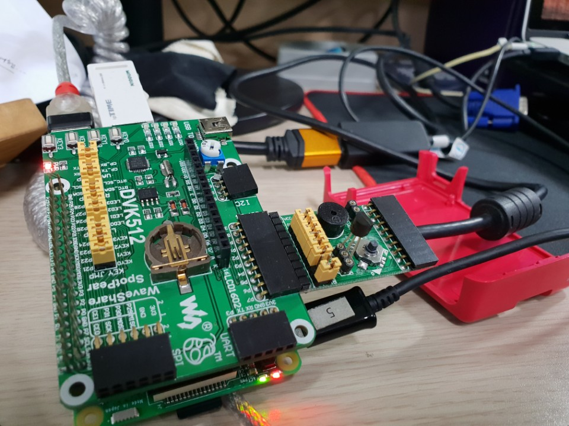

<br>

###### Practice Code

```python
import os, glob, time
#os.system('modprobe w1-gpio')

os.system('modprobe w1-therm')
base_dir = '/sys/bus/w1/devices/'
device_folder = glob.glob(base_dir + '28*')[0]
device_file = device_folder + '/w1_slave'

def read_temp_raw():
    f = open(device_file, 'r')
    lines = f.readlines()
    f.close()
    return lines


def read_temp():
    lines = read_temp_raw()
    while lines[0].strip()[-3:] != 'YES':
        time.sleep(0.2)
        lines = read_temp_raw()
    equals_pos = lines[1].find('t=')
    if equals_pos != -1:
        temp_string = lines[1][equals_pos+2:]

    temp_c = float(temp_string) / 1000.0
    return temp_c


while True:                                                                                                
    print "Temper : ",read_temp()
    time.sleep(1)
```

<br>

###### Practice Result

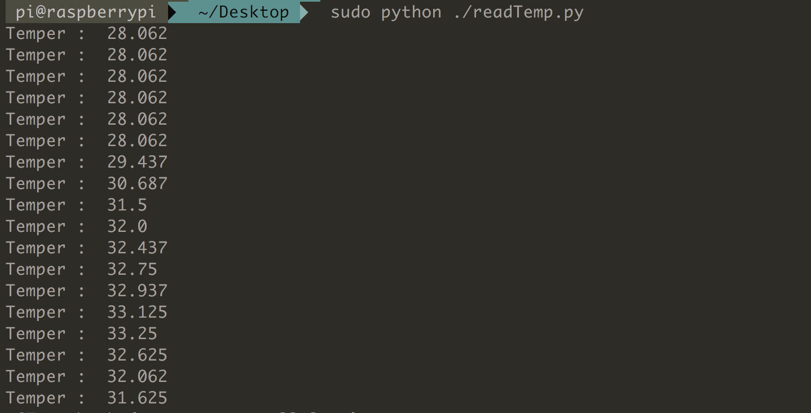


<br>

#### Practice 4.

```
DHT22 온도 센서를 구동하는 프로그램을 작성하고 실행시켜 그 결과를 확인해 본다.
```

###### 실습 장비 구성

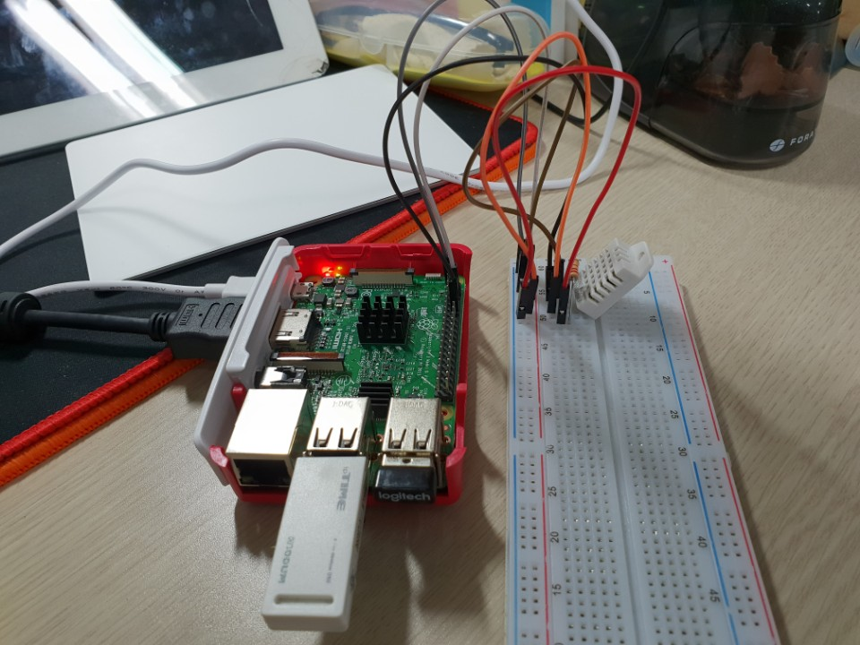

<br>

###### Practice Code

```python
#!/usr/bin/env python

import Adafruit_DHT
import time
sensor = Adafruit_DHT.DHT22
pin=18

while True:
    time.sleep(1)
    humidity, temperature = Adafruit_DHT.read_retry(sensor, pin)

    if humidity is not None and temperature is not None:
        print "Temp={0:0.1f}*C Humidity={1:0.1f}%".format(temperature, humidity)

    else:
        print "Failed to get reading. Try again!"
```

<br>

###### Practice Result

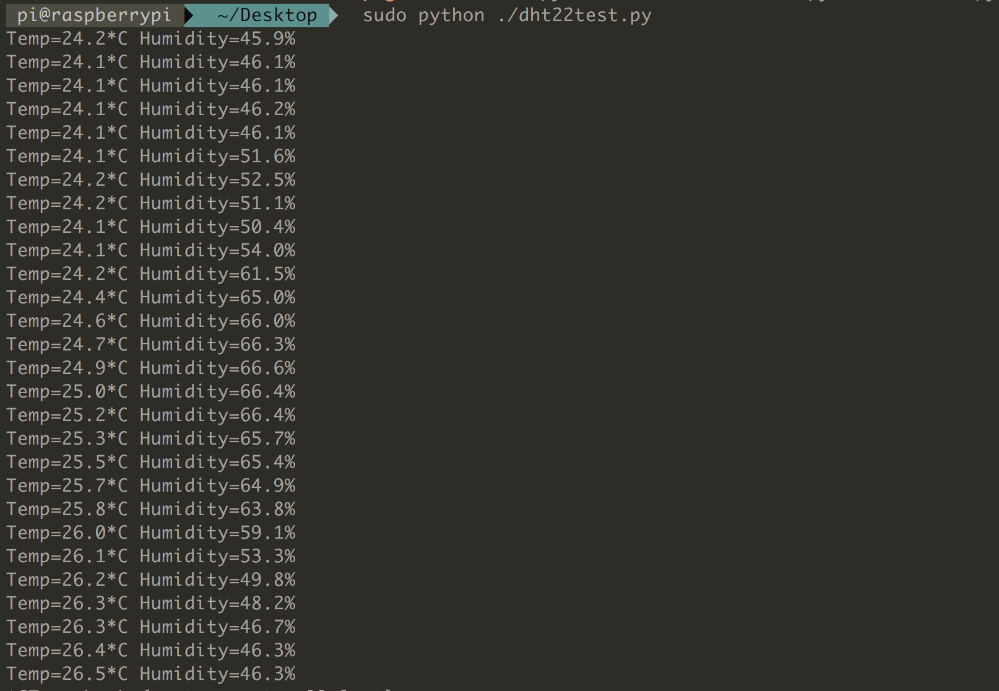


<br>

#### Practice 5.

```
온도센서의 측정 값을 DB에 저장하고 웹에 게시하는 프로그램을 작성하고 테스트해 본다.
```

###### 실습 장비 구성

- Practice 4와 동일 구성.

<br>

###### Practice Code

- [readTemp.py]
```python
import os, glob, time, sqlite3
from bottle import *
from datetime import datetime

os.system('modprobe w1-therm')

base_dir = '/sys/bus/w1/devices/'
device_folder = glob.glob(base_dir + '28*')[0]
device_file = device_folder + '/w1_slave'

db = sqlite3.connect("temp.db")
cur = db.cursor()

def read_temp_raw():
	f = open(device_file, 'r')
	lines = f.readlines()
	f.close()
	return lines

def read_temp():
	lines = read_temp_raw()
	while lines[0].strip()[-3:]!='YES':
		time.sleep(0.2)
		lines = read_temp_raw()
	equals_pos = lines[1].find('t=')
	if equals_pos != -1:
		temp_string = lines[1][equals_pos+2:]
	temp_c = float(temp_string) / 1000.0
	return temp_c

while True:
	cur_time = datetime.now()
	cur_temp = read_temp()
	cur.execute("insert into mytemp values(?,?)",(cur_time,cur_temp,))
	db.commit()
	print cur_time
	print cur_temp
	time.sleep(1)
```

- [tempbottle.py]

```python
from bottle import run,route,template,install
from bottle_sqlite import SQLitePlugin

sqlite = SQLitePlugin(dbfile="temp.db")
install(sqlite)
@route('/temp')
def showtemp(db):
    row = db.execute("select * from mytemp")
    if row:
        return template('temp_tpl',items=row)
    return HTTPError(404,"Page not found")

run(host='0.0.0.0',port=8080)
```


<br>

###### Practice Result

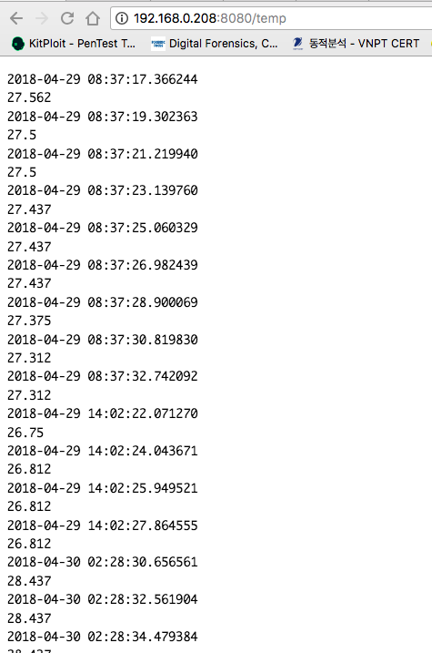


<br>

#### Practice 6.

```
CP2102 USB-to-UART 칩으로 라즈베리파이와 PC의 USB 포트를 연결하여 통신하는 프로그램을 작성하고 그 결과를 확인해 본다.
```

###### 실습 장비 구성

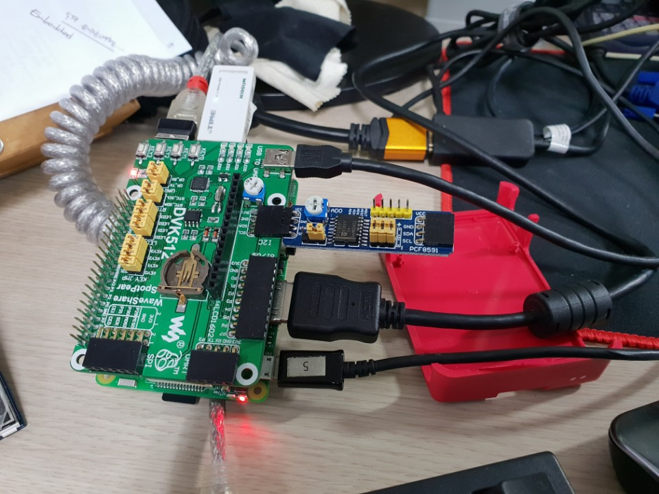

<br>

###### Practice Code

```python
import serial

con = serial.Serial('/dev/ttyS0', 9600)
while True:
    text = raw_input("input any text message : ")
    con.write(text+'\r\n')

```

<br>

###### Practice Result

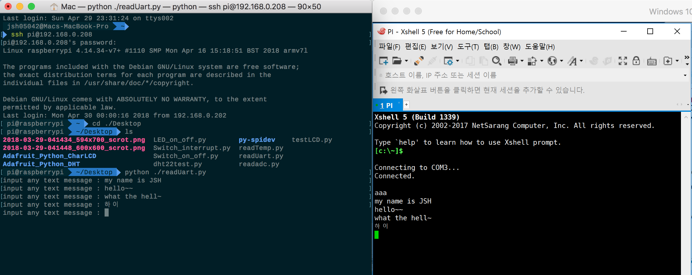


<br>

#### Practice 7.

```
DVK512 보드의 적외선 센서를 활용하여 TV 리모컨을 동작시켜 본다.
```

###### 실습 장비 구성

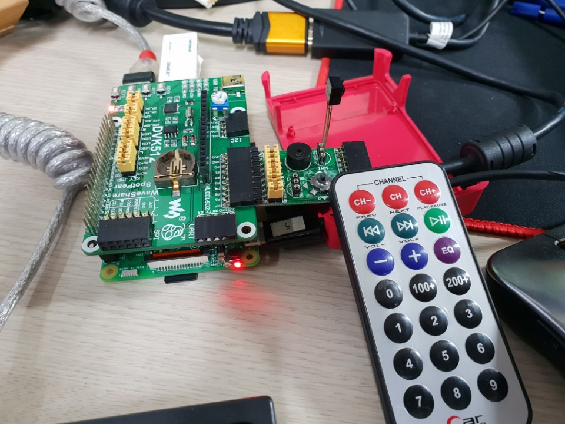

<br>

###### Practice Result

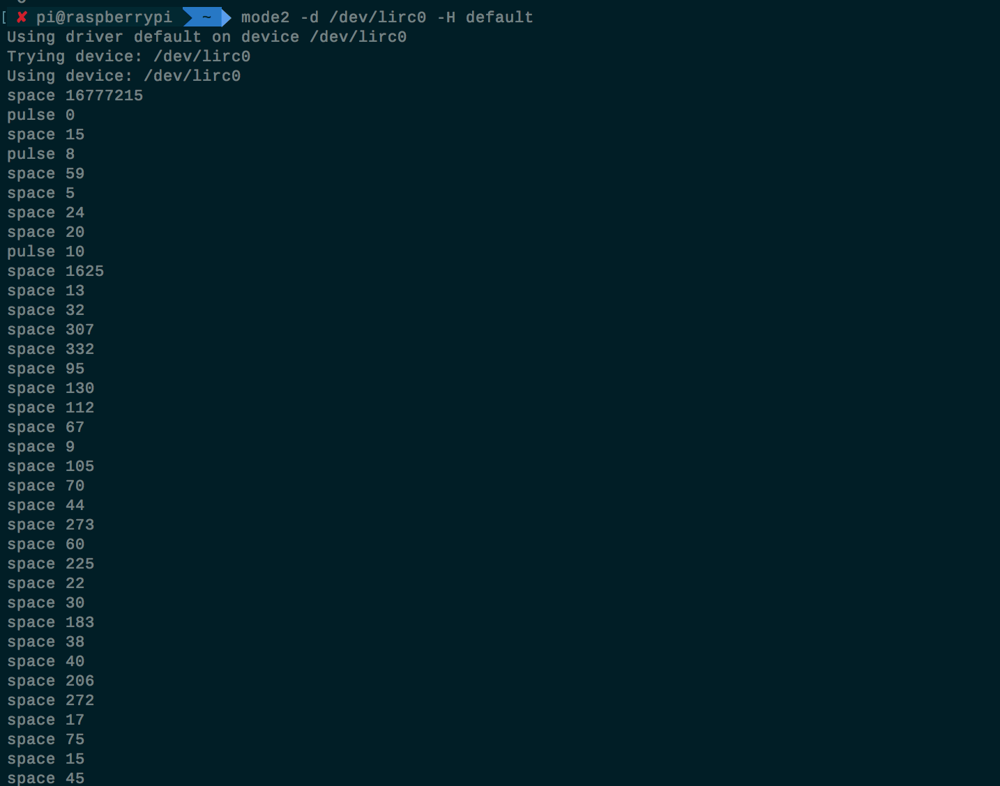


<br>

#### Practice 8.

```
LCD1602 보드를 라즈베리파이와 연결하여 LCD 화면에 글자를 출력하는 프로그램을 작성하고 그 결과를 확인해 본다.
```

###### 실습 장비 구성

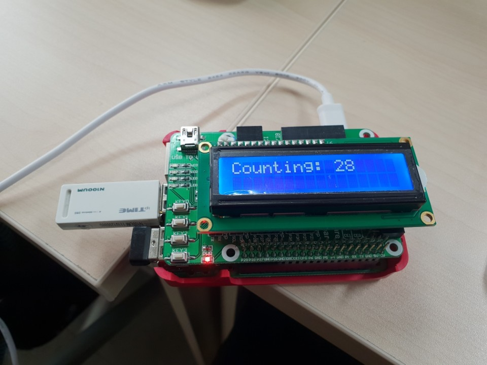

<br>

###### Practice Code

```python
from Adafruit_CharLCD import Adafruit_CharLCD
from time import sleep

lcd = Adafruit_CharLCD(rs=22, en=11, d4=23, d5=10, d6=9, d7=25, cols=16, lines=2)
i=0

while True:
    lcd.clear()
    lcd.message('Counting: ' + str(i))
    sleep(1)
    i=i+1

```

<br>

###### Practice Code

- None


<br>

###### Practice Result

- 장비 구성과 동일


<br>

#### Practice 9.

```
3.5인치 TFT LCD 보드를 라즈베리파이와 연결하여 X 윈도우를 동작시켜본다.
```

###### 실습 장비 구성

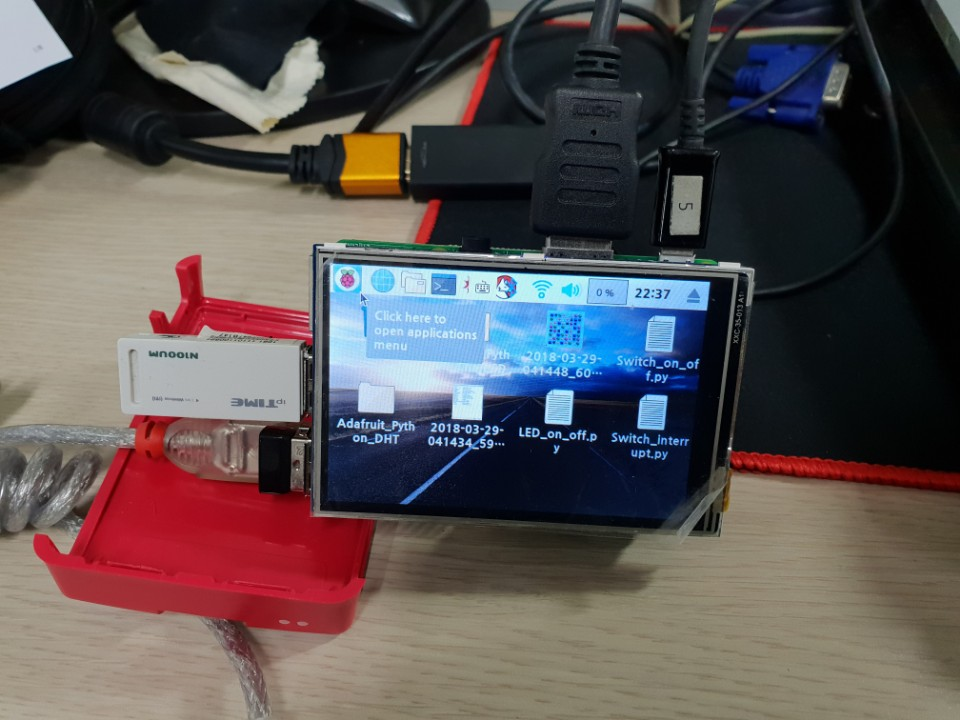

<br>

###### Practice Code

- None

<br>

###### Practice Result

- 장비 구성과 동일
